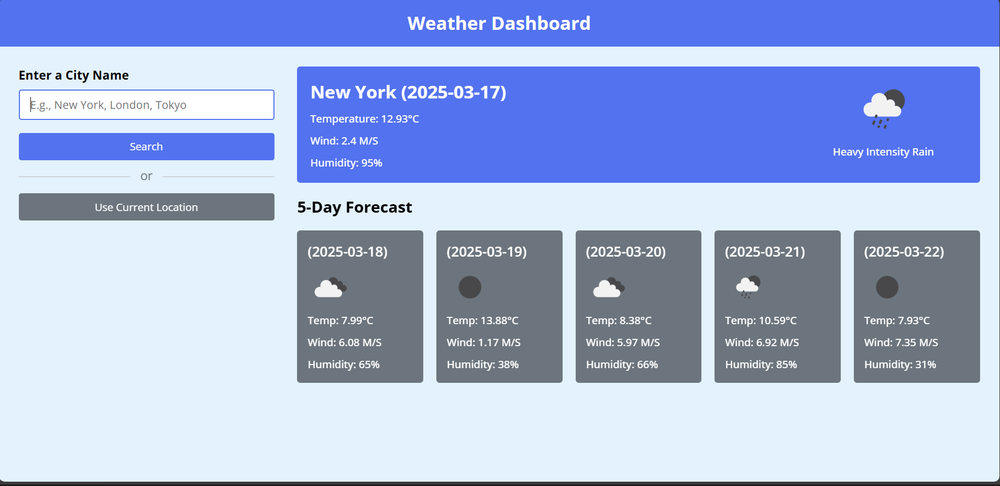

# ⛅ Weather App 🌦  

Welcome to the **Weather App**! 🌍 This simple and modern weather application provides **real-time weather updates** and a **5-day forecast** for any city. It fetches accurate weather data using the **OpenWeatherMap API**.  

## 📸 Screenshot  
  

## 🌟 Features  

🌡 **Live Weather Data**  
📡 Fetches real-time weather details like **temperature, humidity, and wind speed**.  

📅 **5-Day Forecast**  
📊 Provides an extended weather outlook with key metrics.  

📍 **Location-Based Weather**  
🗺️ Get weather updates for **your current location**.  

🔎 **Search Functionality**  
🌎 Search for weather by **city name instantly**.  

📱 **Responsive Design**  
💻 Fully optimized for **desktop, tablet, and mobile screens**.  

## 🛠 Tech Stack  

- **Frontend:** HTML, CSS, JavaScript  
- **API:** OpenWeatherMap API  

## ⚡ Getting Started  

### Prerequisites  
To run this app, you’ll need:  
✅ A **free API key** from [OpenWeatherMap](https://openweathermap.org/)  
